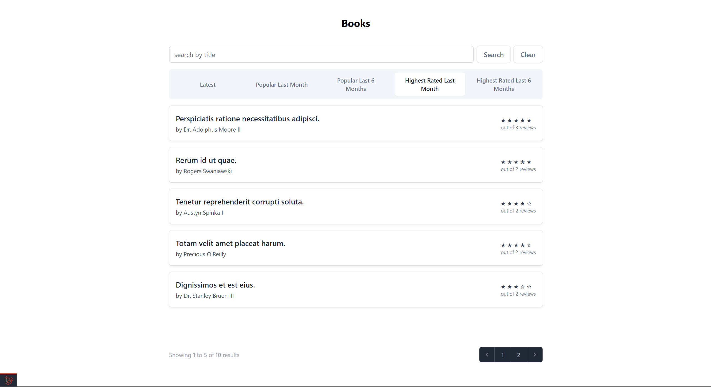

# 📝 Book Reviews: Simple Books Rating page

## App Screenshots

<span align="center">
  
</span>
<span align="center">
  
</span>
<p align="center">
  
</p>

A fast and elegant Laravel application to add books, write and manage reviews with caching for speed and rate limiting to prevent spam.


✨ **Why Book Reviews?**
- ✅ Easy book addition and review management
- ⚡ Cached data loading for fast response
- ⏳ Rate limiter: max 3 reviews per user per hour
- 🎨 Clean UI and intuitive workflow

## 🛠️ Installation Guide

### 📋 Prerequisites
- PHP 8.1+
- Composer 2.0+
- MySQL 8.0+ (or Docker)

### ⚙️ Environment Configuration

1. Copy the environment template:
   
   Create file name .env
   cp .env.example to .env
   

🧰 Dependency Installation
# Install PHP dependencies

```bash
composer install
```

🗃️ Database Setup

Using Docker (Recommended)
bash

Ensure that docker installed and running 

```bash
docker compose up 
```

Create a database named book-reviews

Update your .env with correct credentials

🌐 Access the Adminer DB at: http://localhost:8080/

Choose :-

System : MySQL / MariaDB
Server : MySQL
Username : root
password : root

Run migrations:
```bash
php artisan migrate --seed
```

🚦 Running the Application

Start the development servers in two separate terminals:

Backend Server:

```bash
php artisan serve
```

🌐 Access the application at: http://localhost:8000


🚨 Troubleshooting
Issue	Solution
Database connection errors	Verify MySQL service is running

Permission errors	Run chmod -R 775 storage bootstrap/cache

Missing APP_KEY	Run php artisan key:generate


🌟 Features

✔️ Add, edit, and delete books

✔️ Write, manage, and paginate reviews

✔️ Cached book and paginated reviews for fast loading

✔️ Rate limiting: max 3 reviews per user per hour

✔️ Clean and responsive UI

✔️ User-friendly error handling and validation

